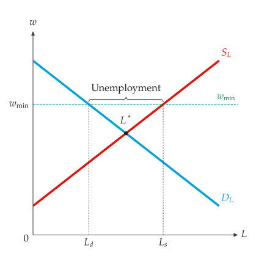
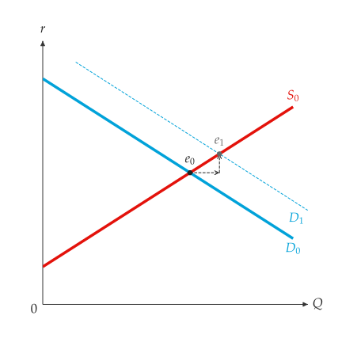

# 勞動與可貸資金

<span id="sec-factor"></span>

## 最低工資

<!-- api: agora.principle_viz.guides_factor_markets_1 -->

設有工資下限的競爭勞動市場。`MinimumWageResult` 包含 `equilibrium`、`minimum_wage`、`is_binding`、`labor_demanded`、`labor_supplied`、`employment`（兩者中較小者）、`unemployment`（兩者之差）與 `wage_bill`。

```python
from principle_viz import analyze_minimum_wage

labor_demand = line_from_inverse(12, -1)
labor_supply = line_from_inverse(2, 1)
labor = analyze_minimum_wage(
    labor_demand,
    labor_supply,
    minimum_wage=9,
)
# 3.0 4.0
print(labor.employment, labor.unemployment)
```

<!-- api: agora.principle_viz.guides_factor_markets_2 -->

以價格下限的方式繪製工資下限（詳見[價格管制](controls.md#sec-controls)）："Minimum wage" 線、工資軸上的 $w_{\min}$，有約束時另標出 $L_d$ 與 $L_s$ 及 "Unemployment" 括號。座標軸命名為 $L$ 與 $w$，曲線命名為 $D_L$ 與 $S_L$（參見[有約束的最低工資。](factor-markets.md#fig-minimum-wage)）：

```python
fig = MarketFigure(x_max=11, y_max=14, x_label="L", y_label="w")
fig.add_curves(
    labor_demand,
    labor_supply,
    q_max=10,
    demand_label="$D_L$",
    supply_label="$S_L$",
)
fig.add_minimum_wage(labor)
```

<span id="fig-minimum-wage"></span>

{ .ev-figure-sm }

`labor_demanded` 為 3，`labor_supplied` 為 7，`employment` 為 3，`unemployment` 為 4。

## 可貸資金

<!-- api: agora.principle_viz.guides_factor_markets_3 -->

儲蓄（供給）與投資（需求）以數量衡量的水平移動。政府借款（不得為負）加入可貸資金的需求。

<!-- api: agora.principle_viz.guides_factor_markets_4 -->

移動前後的可貸資金市場：`baseline_equilibrium`、`shifted_equilibrium`、`shifted_savings`、`shifted_investment_demand`、`private_investment_after`、`interest_rate_change`，以及 `crowding_out`，即利率上升所排擠的民間投資。

```python
from principle_viz import (
    LoanableFundsScenario,
    analyze_loanable_funds,
)

savings = line_from_inverse(2, 0.5)
investment = line_from_inverse(12, -0.5)
scenario = LoanableFundsScenario(government_borrowing=4)
funds = analyze_loanable_funds(savings, investment, scenario)
# 1.0 2.0
print(funds.interest_rate_change, funds.crowding_out)
```

`interest_rate_change` 為 1.0，`crowding_out` 為 2.0。

<!-- api: agora.principle_viz.guides_factor_markets_5 -->

畫出移動後的曲線並命名為 $D_1$ 或 $S_1$，以及兩個均衡點與其間的移動。價格軸命名為 $r$（參見[政府借款排擠民間投資。](factor-markets.md#fig-loanable-funds)）。

<span id="fig-loanable-funds"></span>

{ .ev-figure-sm }
