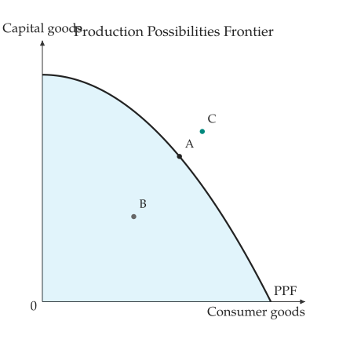
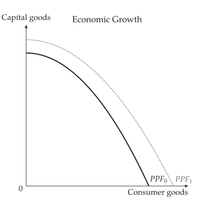

# 生產可能曲線

<span id="sec-ppf"></span>

<!-- api: agora.principle_viz.guides_ppf_1 -->

通過截距 $X$ 與 $Y$ 的生產可能曲線

$$
y = Y (1 - (x / X)^c).
$$

曲率 $c = 1$ 為直線（機會成本固定）；$c > 1$ 時曲線向外凸出（機會成本遞增）。截距與曲率必須為正且 $c \ge 1$，否則拋出 `PPFError`。

```python
from principle_viz import ProductionPossibilitiesFrontier

ppf = ProductionPossibilitiesFrontier(
    10,
    8,
    curvature=2,
    x_good="Consumer goods",
    y_good="Capital goods",
)
# 5.12 0.96
print(ppf.y_at(6), ppf.opportunity_cost_x(6))
print(ppf.assess(4, 3), ppf.assess(7, 6))
# PointStatus.INEFFICIENT PointStatus.UNATTAINABLE
```

<!-- api: agora.principle_viz.guides_ppf_2 -->

在曲線上取樣，並評估以 `(x, y, label)` 三元組給定的點；`principle_viz.visuals.ppf` 中的 `ppf_canvas()` 畫出曲線、為可達成的區域填色並標出各點（參見[有效率、無效率與無法達成的點。](ppf.md#fig-ppf)）。

```python
from principle_viz import analyze_ppf
from principle_viz.visuals.ppf import ppf_canvas

points = ((6, ppf.y_at(6), "A"), (4, 3, "B"), (7, 6, "C"))
result = analyze_ppf(ppf, points=points)
ppf_canvas(result).save("ppf_points.png")
```

<span id="fig-ppf"></span>

{ .ev-figure-sm }

<!-- api: agora.principle_viz.guides_ppf_3 -->

經濟成長使各截距乘以一加上對應的成長率；結果包含 `baseline` 與 `shifted` 兩條曲線及其取樣點。`ppf_growth_canvas()` 畫出兩條曲線並命名為 $P P F_0$ 與 $P P F_1$（參見[消費財成長 20%、資本財成長 10%。](ppf.md#fig-ppf-growth)）。

<span id="fig-ppf-growth"></span>

{ .ev-figure-sm }

## 比較利益

<span id="sec-comparative-advantage"></span>

<!-- api: agora.principle_viz.guides_ppf_4 -->

比較兩條直線型生產可能曲線：各生產者生產 $x$ 的機會成本，以及各商品的比較利益歸屬（成本相同時為 `"tie"`）。曲線型的生產可能曲線會拋出 `PPFError`。

```python
from principle_viz import compare_linear_ppfs

# x costs 0.5 y
ann = ProductionPossibilitiesFrontier(10, 5)
# x costs 1 y
bob = ProductionPossibilitiesFrontier(6, 6)
result = compare_linear_ppfs("Ann", ann, "Bob", bob)
print(
    result.comparative_advantage_x,
    result.comparative_advantage_y,
)
# Ann Bob
```

$x$ 的比較利益屬於 Ann（0.5 對 1），$y$ 屬於 Bob（1 對 2）。
