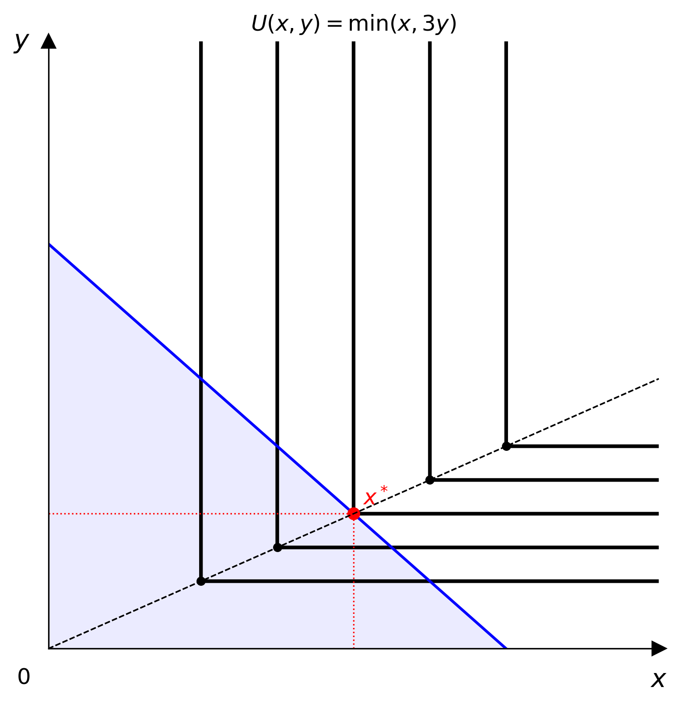
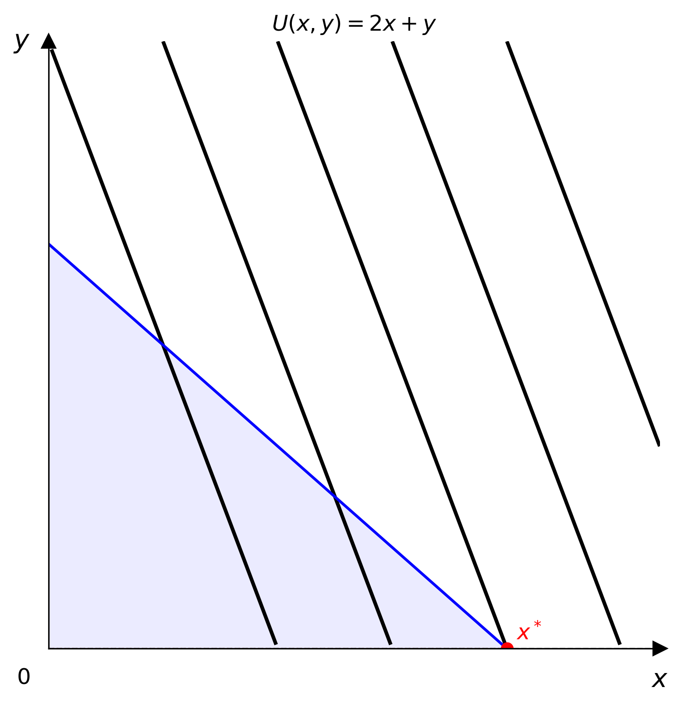

# LaTeX 解析

`parse_latex` 會把 LaTeX 數學字串直接轉成具體的模型物件。

```python
from econ_viz import parse_latex

model = parse_latex(r"x^{0.4} y^{0.6}")  # CobbDouglas(alpha=0.4, beta=0.6)
model = parse_latex(r"\min(2x, 3y)")     # 完全互補模型，a=2.0，b=3.0
model = parse_latex(r"2x + 3y")          # PerfectSubstitutes(a=2.0, b=3.0)
```

## 支援的形式

| 類型 | 格式 | 範例 |
|--------|---------|---------|
| Cobb-Douglas | `x^{α} y^{β}` 或 `x^α y^β` | `x^{0.3} y^{0.7}` |
| 完全互補 | `\min(ax, by)` 或 `min(ax, by)` | `\min(2x, y)` |
| 完全替代 | `ax + by` | `3x + 1.5y` |

係數與指數都可以省略，預設為 1。

## 輸入格式

可以只輸入效用式，也可以在前面加上 `U =` 或 `U(x, y) =`：

```
U(x,y) = x^{0.5} y^{0.5}
U = x^{0.5} y^{0.5}
x^{0.5} y^{0.5}
```

## 錯誤處理

無法辨識的格式會拋出 `econ_viz.exceptions.ParseError`：

```python
from econ_viz.exceptions import ParseError

try:
    model = parse_latex(r"x^2 + y^2")
except ParseError as e:
    print(e)

# Unrecognised LaTeX utility function: 'x^2 + y^2'
# Supported forms:
#   Cobb-Douglas       : x^{alpha} y^{beta}
#   完全互補            : \min(ax, by)
#   Perfect Substitutes: ax + by
#   CES                : (alpha x^{rho} + beta y^{rho})^{1/rho}
```

## 在命令列工具中使用

```bash
econ-viz plot --latex "x^{0.4} y^{0.6}" --px 2 --py 3 --income 30 -o out.png
```




